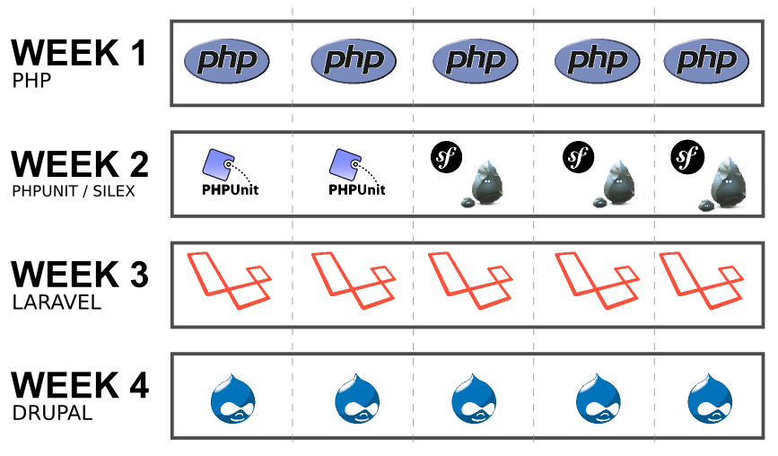
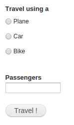
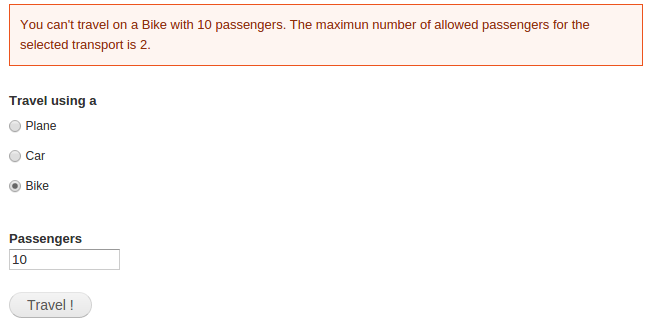

# PHP/Drupal BootCamp base folders layout

Please, use this repository as a base for you training phase. The idea is to
fork this project so everyone use the same folder structure for the
exercises.

# PHP Boot Camp

#### Index

1. [Objective](#objective)

2. [Who Should Attend](#who-should-attend)

3. [Duration](#duration)

4. [Technical Assistance](#technical-assistance)

5. [Performance Measurement](#performance-measurement)

6. [Handling advanced Developers](#handling-advanced-developers)

7. [Materials](#materials)

8. [Bootcamp Schedule](#bootcamp-schedule)

9. [General Guidelines](#general-guidelines)

10. [Learning Days](#learning-days)

  - 10.1 [Week 1: PHP Object Oriented](#week-1-object-oriented-php-basics)
  - 10.2 [Week 2: PHP Testing and Framworks](#week-2-php-testing-and-frameworks)
  - 10.3 [Week 3: Laravel](#week-3-laravel)
  - 10.4 [Week 4: Drupal](#week-4-drupal)


### Objective

This course teaches the basics of PHP development applications and introduces
you to the Laravel and Drupal world.

→ [index](#index)

### Who Should Attend

The training will start at a low level and does not require in depth knowledge
of the platform in question. Desirable participant profile: trainees and outside
Globant candidates. A basic knowledge on OOP is desired, though.

→ [index](#index)

### Duration

Four weeks total. (20 days)

→ [index](#index)

### Technical Assistance

You can contact other Bootcamp participants or any available tutor if you need
technical assistance. We will create one chat for boot camp members only, and
another one for boot camp members and tutors when boot camp starts.

### Performance Measurement

1. Code review after each practice.

2. Checkpoint completion after Learning stage with your assigned tutor.

→ [index](#index)


### Handling Advanced Developers

Developers that move faster than average can go ahead and complete as much
exercises as wanted.

→ [index](#index)

### Materials

1. You will need to install https://www.virtualbox.org and
https://www.vagrantup.com in order to run the virtual machine that contains all
the tools required for the Bootcamp.

2. There is no preference regarding IDE. You can use Sublime Text 3, Atom or any IDE of your preference.

3. Gmail Account + headset (For hangout calls)

4. Create your own [GitHub](https://github.com/) account. Follow
this [guideline](https://help.github.com/articles/set-up-git) to setup your
account. Also you can read further about Git in
[Try Git](https://try.github.io/levels/1/challenges/1) or
[Learn Git Branching](http://pcottle.github.io/learnGitBranching/)

5. Fork this repo to use as a base to host the project code.

→ [index](#index)

### Bootcamp Schedule

The boot camp is organized in the following way:



The first week is oriented to learn the PHP object oriented basics. This
Bootcamp assumes you already know the basics of PHP syntax. If this is not your
case, it is recommended to take a look to the following topics:

- [PHP Variables and constants](http://codehero.co/php-desde-cero-variables-constantes)
- [PHP Operators](http://codehero.co/php-desde-cero-operadores)
- [PHP Control Structures](http://codehero.co/php-desde-cero-estructuras-de-control)
- [PHP Functions](http://codehero.co/php-desde-cero-funciones)
- [PHP Arrays](http://codehero.co/php-desde-cero-arreglos)

Each day of the first week you will have a small exercise at the end of the day.
You must code the exercise inside the corresponding folder, example
VM/public/Day1/index.php will contain the code for the exercise of the Day 1.

The second week introduces you to the PHP ecosystem. Nowadays is really odd to
find programmers that write everything from scratch, instead they re-use tools
written by other developers. At the end of week two you will learn how to test
your code and write a web APP using a framework called Silex.

The third week is oriented to learn Laravel. Laravel is one of the most popular
PHP frameworks of the open source world, during this week the challenge will be
to code an API application that could be used by any other APP like a mobile APP
or a client side APP using AngularJS or React.

The last week will be focused on Drupal. Drupal is a different kind of
technology based on PHP. This system will allow you to build entire sites in a
few days. At the end of the Bootcamp you will have to build a complex website,
don't worry is not so difficult.

### General Guidelines

1. [Team play](http://www.dummies.com/how-to/content/ten-qualities-of-an-effective-team-player.html) is encouraged but the work will be evaluated per person.

2. The instructions will be vague as they generally are in real life projects.
You must look for support and guidance from your PM, teammates and tutors.

3. All code and documentation must be in English.

4. PHP Code must adhere to this [Coding Style Guide](http://www.php-fig.org/psr/psr-2/).

5. Drupal (Week 4) code must adhere to this [Drupal Coding Standards](https://drupal.org/coding-standards).

→ [index](#index)

### Learning Days ###

Each day you will grab the fundamentals of the key building blocks for usual
PHP applications.

On each learning day you will have to:

1. **Read:**

We will provide you with documentation related with current sprint content so
you can have a background reference, guide and examples to complete the
following practice.

2. **Practice:**
You will implement the previously gathered knowledge in simple coding activities.

3. **Commit:**
You will commit all your code on a daily basis, when you finish your practice. This will not apply for code of Week 4.

# Introduction

  - This repository contains inside the VM directory the code for the box.scotch.io
project. You will need to [Install and understand what is a Virtual Machine](https://box.scotch.io/#get-started) to run the code of this Bootcamp. If you already installed Vagrant and Virtualbox on your machine, you just have to run from a terminal the command **vagrant up** inside the directory VM (that contains the Vagrantfile file).

  - If you use a 32 bit system, the box.scotch.io will not work since is a 64bit system. In that case, just remove the file VM/Vagrantfile and rename the VM/Vagrantfile.32bits to VM/Vagrantfile. Then run vagrant up as usual.

  - If you use Windows, you may want to use [Putty](http://www.putty.org/) to connect via SSH to the virtual machine.

  - All the modifications you make on the VM/public folder will be automatically available inside the virtual machine. Remember once you start the VM it is accessible through the http://192.168.33.10 url, unless you modify that IP on the VM/Vagrantfile file.

  - [Basic GIT concepts](https://git-scm.com/book/en/v2/Git-Basics-Getting-a-Git-Repository)

  - [Learn basic PHP concepts](http://www.phptherightway.com/pages/The-Basics.html)

  - [Basic PHP Object Oriented](http://php.net/manual/es/language.oop5.basic.php)

→ [index](#index)

# Week 1: Object Oriented PHP Basics

## Day 1: Introduction to Object Oriented PHP

### Reading:

- [Introduction](http://php.net/manual/en/oop5.intro.php)
- [The Basics](http://php.net/manual/en/language.oop5.basic.php)
- [Properties](http://php.net/manual/en/language.oop5.properties.php)
- [Class Constants](http://php.net/manual/en/language.oop5.constants.php)
- [Autoloading Classes](http://php.net/manual/en/language.oop5.autoload.php)
- [Constructors and Destructors](http://php.net/manual/en/language.oop5.decon.php)
- [Visibility](http://php.net/manual/en/language.oop5.visibility.php)
- [Object Inheritance](http://php.net/manual/en/language.oop5.inheritance.php)

### Exercise:

Create 3 classes, one for Planes, other for Cars and other for Bikes.
Then create an instance of each of those classes. Each object should be able to
react to the following methods. canFly, speed, maxPassengers.

When visiting index.php the user should see the following output:

```
<ul>
<li>Plane: Speed: 900 Km/h. It can fly. Max passengers: 650</li>
<li>Car: Speed: 110 Km/h. It can not fly. Max passengers: 5</li>
<li>Bike: Speed: 25 Km/h. It can not fly. Max passengers: 2</li>
</ul>
```

**Notes:**

- The speed limits and the number of passengers are not important, invent them.
- It doesn't matter if you return strings, numbers or boolean values.
- Create each class on their own file.
- Use the PSR-2 coding standard.

## Day 2: Working with forms on PHP

### Reading:
- [Working with forms on PHP](http://codehero.co/php-desde-get-post/)
- [Sanitize input on forms](http://code.tutsplus.com/tutorials/sanitize-and-validate-data-with-php-filters--net-2595)
- [Form Validation](http://www.sitepoint.com/form-validation-with-php/)

### Exercise:

- Copy and paste the classes from the exercise 1.
- Create a webform like this one:



Then, when the user submit the data, the APP must validate that the amount of
passengers can travel using the selected transport.



If the validation pass, the user should be redirected to a new window that says
"Ok! you can now travel. Bye"

**Notes:**

- Try to reuse the code from the classes. You can modify them if you need it.
- Remember sanitize the user input.
- If you have issues trying to display the message with that format, you may
want to check: http://www.cssbasics.com/

## Day 3: Object Oriented PHP Advanced topics

### Reading:

- [Scope Resolution Operator (::)](http://php.net/manual/en/language.oop5.paamayim-nekudotayim.php)
- [Static Keyword](http://php.net/manual/en/language.oop5.static.php)
- [Class Abstraction](http://php.net/manual/en/language.oop5.abstract.php)
- [Object Interfaces](http://php.net/manual/en/language.oop5.interfaces.php)

### Exercise:

- Based on the classes defined on the exercise 1 now create an abstract class called Transport to provide a shared method that returns the travel distance based on the time of travel (number of minutes) and the max speed of the transport.
- Create an interface that force all Transports to implement the methods canFly, speed and maxPassengers.
- Modify the existent classes (Plane, Car, and Bike) to use this new additions.

## Day 4 and 5: Connect PHP to databases and introduction to Foundation 5
- [using PHP's PDO for Database Access](http://code.tutsplus.com/tutorials/why-you-should-be-using-phps-pdo-for-database-access--net-12059)
- [Introduction to Foundation 5 grid system](http://blog.teamtreehouse.com/beginners-guide-grids-zurb-foundation-5)

### Exercise:

Use the day 4 and 5 to build an application for a bookstore. There is a database
dump of the EndWeek1 folder that you must use to build this APP.

To restore the database use the following commands:

- ```mysql -u root -proot -e "CREATE DATABASE bookstore;"```
- ```mysql -u root -proot bookstore < bookstore.sql```

If you need help trying to understand the structure of the database, read the
**Database Access** section at https://box.scotch.io

Or you can install phpmyadmin inside the virtual machine by running

- Login via ssh to your VM and execute: ```sudo apt-get install phpmyadmin -y```
- Visit http://192.168.33.10/phpmyadmin (user: root pass: root) to access.

The application must contain the following features:

- List all the available books in a table.
- When clicking on one book, it should redirect to book/ID and display the book
title, description and price.
- Ability to edit a product item under book/ID/edit. (Don't worry about login
and access restriction features, is not required for this exercise)
- Be able to search for a book based on some substring of the title.

**Notes:**

- Remember the security implications (see day 2).
- Try to make the APP look pretty, use the foundation 5 framework to avoid
re-invent the wheel. (You could use Bootstrap 3 if you want too).
- Use oriented object programming.
- At least try to write one of two tests for the Book class.

→ [index](#index)

# Week 2: PHP Testing and Frameworks

### Reading:

## Day 6: PHP Ecosystem, Composer, and Twig
- [Meet Composer](https://laracasts.com/series/laravel-5-fundamentals/episodes/1)
- [PHP Dependency Management](http://www.phptherightway.com/#dependency_management)
- [PHP Packages - Packagist](https://packagist.org/about)
- [Twig introduction](http://twig.sensiolabs.org/doc/intro.html)
- [Twig Template system](http://twig.sensiolabs.org/doc/templates.html)

### Exercise:

- Install the symfony/yaml package and the twig/twig packages
- Create a program that use that package to read the file books.yml provided in the Exercise6 Folder
- Using twig, create a template to list all the books of the yml file following the next structure:

```
<div class="books">
  <div class="book">
    <h1>Book Title: A Game of Thrones</h1>
    <h2>Author: George R. R. Martin</h2>
    <strong>Main characters:</strong>
    <ul>
      <li>Ned Stark</li>
      <li>Robert Baratheon</li>
      <li>Tyrion Lannister</li>
      ...
    </ul>
  </div>
  ...
</div>
```

- Finally, on the index.php file, load the template and print it on the screen.

## Day 7: Unit Testing

### Reading:

- [Unit testing tutorial part 1](https://jtreminio.com/2013/03/unit-testing-tutorial-introduction-to-phpunit/)
- [Unit testing tutorial part 2](https://jtreminio.com/2013/03/unit-testing-tutorial-part-2-assertions-writing-a-useful-test-and-dataprovider/)
- [Unit testing tutorial part 3](https://jtreminio.com/2013/03/unit-testing-tutorial-part-3-testing-protected-private-methods-coverage-reports-and-crap/)
- [Mock Objects](http://code.tutsplus.com/tutorials/mockery-a-better-way--net-28097)

### Exercise:

- Install https://packagist.org/packages/mockery/mockery using composer
- On exercise of Day 6 you coded something that read content from a yml file. As you may have read on the reading section of Day 7, unit testing is all about code isolation. The exercise for this day is to create a test that mock the yml parser in order to simulate the reading of the file without actually need the symfony/yaml component.

**Notes:**

You may want to check the https://github.com/symfony/yaml/ source code to see what arguments are expected by the parser.

## Day 8, 9 and 10: PHP Frameworks: Introduction to Symfony 2 and Silex

The objective of the next 3 days is to learn how a framework can help you to build better PHP APPs. In this section you will learn about a framework called Symfony and a microframework based on symfony called Silex. Your goal is to adapt the application you wrote during the end of week 1 using this framework.

### Reading:

- [What is symfony](http://symfony.com/what-is-symfony)
- [Why use a framework](http://symfony.com/why-use-a-framework)
- [Symfony routing](http://symfony.com/doc/current/book/routing.html)
- [What is silex](http://silex.sensiolabs.org/)
- [Silex: Introduction](http://silex.sensiolabs.org/doc/usage.html)
- [Silex: Validator](http://silex.sensiolabs.org/doc/providers/validator.html)
- [Silex: FormServiceProvider](http://silex.sensiolabs.org/doc/providers/form.html)

### Exercise:

Using Silex micro framework, adapt the application you coded during the Days 4 and 5 to use the routing system.

In particular you may want to use:

- The routing system to define the URLs of your application.
- The validator component to validate the submitted data while editing a book.
- The form service provider to build the forms of your application.

→ [index](#index)

# Week 3: Laravel

During week 3 of the Bootcamp, you will learn about Laravel. Laravel is a PHP framework built using several Symfony 2 components. This framework is considered one of the most powerful and easy to learn frameworks of the open source world and will allow you to build clean web application.

Because Laravel can help you to build any kind of application we will be focusing on build an API. An application programming interface (API) is a set of routines, protocols, and tools for building software applications.

If you never saw an API working, you can take a look to the twitter public API. Just login with a twitter account and visit the documentation: https://dev.twitter.com/rest/public

Since understanding Laravel requires read a lot of documentation, during week 3 we will change from reading to screen-casts to make the learning easier.

### Reading:

- [Introduction to APIs - Teach a Dog to REST](https://vimeo.com/17785736)
- [Laravel is not the only framework out there...](https://vimeo.com/137245693)
- [Namespaces](https://laracasts.com/lessons/namespacing-primer)
- [Laravel 5 from scratch](https://laracasts.com/series/laravel-5-from-scratch)
- [Laravel 5 fundamentals](https://laracasts.com/series/laravel-5-fundamentals)
- [Restful APIs with Laravel](http://code.tutsplus.com/tutorials/laravel-4-a-start-at-a-restful-api-updated--net-29785)

### Exercise:

There is only one exercise during week 3, and it consist to build an API for a Hotel.

In this hotel you will have different rooms and guests and bookings.

Each room contains the following information: Room number (ID), Room beds, room
floor, Price per Night, and if the room is currently free or taken by a group of
guests.

Each guest contains the following information: Surname, Name, Age, Personal ID,
and Room ID.

Finally, each Booking contains, the ID of a room, the date of arrive and leaving
and the list of Personal Ids of each guest.

Your API will have to react to the following resources:


```
GET, POST:   /room/ID
GET:         /rooms
GET, POST:   /guest/ID
GET:         /guests
GET, POST:   /booking/ID
GET:         /bookings
```

The API should allow you to:

- List, Create and Update Rooms.
- List free rooms and occupied rooms using the url /rooms?free=true or /rooms?free=false
- List, Create and Update Guests.
- List, Create and Update Bookings.

Here are some tips to help you design this API.

- To try the API you will need a Rest Client, there are a lot of Firefox and
Chrome Extensions, just look for: **rest console** or **rest client** on your
browser extensions page and install one.
- Remember to use Laravel migrations to create the database structure.
- Each resource of the API must be handled by a Controller of the APP.
- Laravel provides its own method to connect to the database, take a look to the
Eloquent docs.
- The output format of the API must be JSON.
- Check the http://laravel.com/docs

→ [index](#index)

# Week 4: Drupal

The last week of the Bootcamp is focused on a different technology built on top
of PHP. This week is about learning Drupal, a Content Management System designed
to build complex web sites without need to write all the code.

### Reading:

- [What is Drupal](https://www.youtube.com/watch?v=Nl1dADk0rU0)
- [Install Drupal](https://drupalize.me/videos/installing-drupal-7?p=1153)
- [Creating content types](https://www.youtube.com/watch?v=bmWPYQEZzvQ)
- [Creating content types](https://www.youtube.com/watch?v=j7M44s0kSps)
- [Install Drupal Modules](https://www.youtube.com/watch?v=3b2YdY8dC7E)
- [An Introduction To Views](https://www.youtube.com/watch?v=Jfq9Aq9aeyM)
- [The Features module](https://www.youtube.com/watch?v=tDdEoZunkkM)
- [Image Styles](https://www.youtube.com/watch?v=vgFo4Md00rY)
- [Creating a block view](https://www.youtube.com/watch?v=BebR07kucT4)
- [Exposed filters on views](https://www.youtube.com/watch?v=2Yk6rre3vi8)
- [Taxonomy terms](https://www.youtube.com/watch?v=Qmr2HW6CtJQ)
- [Text formats](https://www.youtube.com/watch?v=0kf6PAz4yPQ)
- [Text formats](https://www.youtube.com/watch?v=UBrni63_PuY)
- [Theming Basics](https://www.youtube.com/watch?v=sCg4sTA3DlQ)
- [Introduction to panels](https://drupalize.me/videos/introduction-panels?p=1147)
- [Context module](https://www.youtube.com/watch?v=Ce0xGiYkryk)
- [Manage Field Display](https://www.youtube.com/watch?v=j7M44s0kSps)
- [Introduction to Field Collection](https://www.youtube.com/watch?v=1V1ofpgUw-Y)

**Optional reading**
- [Developing Modules in Drupal 7](https://www.youtube.com/watch?v=dmpSFiCym7c)
- [Drupal Forms API](https://www.youtube.com/watch?v=OPB6SlvNOpI)
- [Drupal 7 Module Development (All the guide)](https://www.youtube.com/playlist?list=PL-Ve2ZZ1kZNRJVY5cpaLaJoJdB8AiLA96)

### Exercise:

Since Drupal is so powerful, this exercise will be at first glance a bit
intimidating. Don't worry, most of the features requested on this exercise are
provided by default by a Drupal module, so you will not need to code a lot of
functionality. Instead the key is to discover what is the best module for that
feature.

The idea is to create a website for a Video-Club. The Video-Club owner asked for
the following features.

- Be able to created, edit and delete the movies that the Video-Club rent.
- The website should display a list of movies, with a thumbnail and the movie title.
- Each movie could have different formats, DVD, BluRay or VHS.
- Each format may have a different price.
- The clients of the video club could create an account and logging on the site,
after login in the site, they should be able to bookmark a movie.
- Each user should be able to access to a list of its bookmarked movies.
- The list of movies must provide some filters to search by title, and date of
publication.

**Some advices**

- Checkout the following Drupal contrib modules: Flag, Field Collection, Views,
Date.
- You may want to create a content type for the movie and a field collection for
the Format - Price options.
- Another alternative you could evaluate is use the Double Field module.
- Use the chatroom to evaluate with your teammates the possible alternatives.

## Important: When you finish your site, create a dump of the database inside the Week 4 folder, create a Zip file with the  content of all the Week4 folder and send it to your tutor for review.
